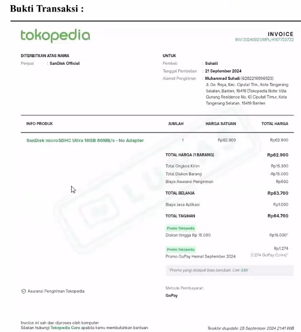

# 📄 Rincian Laporan Keuangan Kelompok (Bulan Oktober)

**Batas Waktu Penyerahan:** Senin, 26 Oktober 2025  
Template: [Google Docs](https://docs.google.com/document/d/1cxCIKDTlwhL-xZkSRiOMjYwKJmcLaGFpdKBun2Yl9SQ/edit?usp=sharing), _make a copy_ template ini untuk setiap kelompok.

## Table of Contents

- [📄 Rincian Laporan Keuangan Kelompok (Bulan Oktober)](#-rincian-laporan-keuangan-kelompok-bulan-oktober)
  - [Table of Contents](#table-of-contents)
  - [1. Laporan Proyek](#1-laporan-proyek)
  - [2. Laporan Keuangan](#2-laporan-keuangan)
    - [A. Tabel Rincian Pengeluaran](#a-tabel-rincian-pengeluaran)
    - [B. Kriteria Keakuratan Data](#b-kriteria-keakuratan-data)
  - [3. Rincian per Item](#3-rincian-per-item)
    - [Bukti Transaksi yang Wajib Dilampirkan (Untuk Setiap *Invoice*):](#bukti-transaksi-yang-wajib-dilampirkan-untuk-setiap-invoice)
    - [Catatan Khusus Dokumentasi:](#catatan-khusus-dokumentasi)
    - [Contoh Rincian per Item:](#contoh-rincian-per-item)
  - [4. Proses pengumpulan](#4-proses-pengumpulan)

---

## 1. Laporan Proyek

Laporan ini berfungsi untuk mendokumentasikan progres proyek.

- **Panjang:** Sekitar 1-3 halaman.
- **Isi:** Laporan harus memuat:
    - Kegiatan yang telah dilaksanakan.
    - Gambar/desain yang sudah dirakit.
- **Kondisi Tanpa Pengeluaran:**
    - Laporan proyek (1-3 halaman) **tetap wajib dibuat**.
    - Pada bagian rincian pembiayaan, harus di-*indicate* atau dijelaskan bahwa **belum ada pengeluaran**.

---

## 2. Laporan Keuangan

Laporan ini harus disajikan dalam bentuk tabel yang mengikuti [format Excel]()

### A. Tabel Rincian Pengeluaran

tabel harus mencakup data yang terperinci untuk setiap transaksi:

- No
- Tanggal transaksi
- Nama item
- Jumlah
- Harga
- *Link* (jika *invoice* digital).
- Total

Contoh:

| No | Tanggal       | Nama Item        | Jumlah | Harga  | Link                                    | Total   |
|----|---------------|------------------|--------|--------|-----------------------------------------|---------|
| 1  | 21 September 2024 | Sandisk microSDHC 16GB | 1     | Rp 64.700 | https://www.tokopedia.com/... | Rp 64.700 |
| 2  | 22 September 2024 | Kabel USB Type-C 1m | 2     | Rp 25.000 | https://www.tokopedia.com/... | Rp 50.000 |
|Total Pengeluaran |               |                  |        |        |                                         | Rp 114.700 |

### B. Kriteria Keakuratan Data

- Semua item harus terperinci dan sesuai dengan yang tercantum di *invoice*.
- **Penting:** Kolom jumlah pengeluaran harus dipastikan berupa **angka atau *currency***, dan **bukan *string*** (misalnya, karena ditambahkan "Rp" secara manual). Kesalahan format ini harus dicek betul-betul untuk menghindari kesalahan penjumlahan total.

---

## 3. Rincian per Item

Setiap item yang diajukan untuk *reimbursement* harus didukung oleh rincian dan bukti transaksi yang lengkap. Laporan akhir harus mengelompokkan item berdasarkan *invoice* tertentu (misalnya, *invoice* 1 berisi item 1, 2, 3), diikuti dengan semua bukti terkait untuk *invoice* tersebut.

### Bukti Transaksi yang Wajib Dilampirkan (Untuk Setiap *Invoice*):

- *Invoice* (misalnya dalam bentuk gambar dari Tokopedia).
- Bukti Pembayaran (*screenshot* transfer dari Bank Mandiri atau BNI).
- Bukti Ekspedisi/Pengiriman (jika menggunakan tokopedia, sudah termasuk di *invoice*).
- **Foto Fisik Barang** ketika sudah diterima dan di-*unboxing*. Foto ini penting untuk memverifikasi kesesuaian jumlah barang yang dibeli (misalnya, jika membeli tiga barang, harus difoto ketiga barang tersebut).

### Catatan Khusus Dokumentasi:

- **Barang yang Belum Sampai:** Jika barang belum sampai pada saat pelaporan (tetapi sudah dibeli sebelum hari Selasa), bukti yang dilampirkan adalah **foto bukti ekspedisi** dan **bukti pembayaran/transfer**.
- **Pembelian Lampau/Digital:** Untuk pembelian yang sudah lampau (bulan sebelumnya) atau *purely digital* yang sudah lewat sebulan dan tidak bisa di-*reimburse* secara normal, kelompok diperbolehkan **membuat receipt sendiri**.
    - Receipt ini harus mencantumkan **tanggal transaksi di bulan Oktober** agar memenuhi syarat *reimbursement*.
    - Bukti ini kemudian harus di-*scan* dan dimasukkan ke dalam dokumen.

### Contoh Rincian per Item:

**Sandisk microSDHC 16GB**

- Tanggal Pembelian : 21 September 2024
- Rincian Harga :
    - Harga Satuan : Rp 62.900
    - Onkos Kirim : Rp 15.300
    - Biaya Proteksi Produk : Rp 500
    - Biaya Jasa Aplikasi : Rp 1.000
    - Diskon : -Rp 15.000
    - **Total Biaya : Rp 64.700**

**Bukti Transaksi:**

  

**Bukti Pembayaran:**

  

**Foto Fisik Barang:**

  

---

## 4. Proses pengumpulan

- Laporan diserahkan kepada **PIC (Edgrant)** maksimal pada hari Senin, 26 Oktober 2025.
- Laporan disarankan dikirimkan dalam format pdf
- PIC akan menggabungkan semua laporan dari setiap anggota kelompok menjadi satu dokumen lengkap.